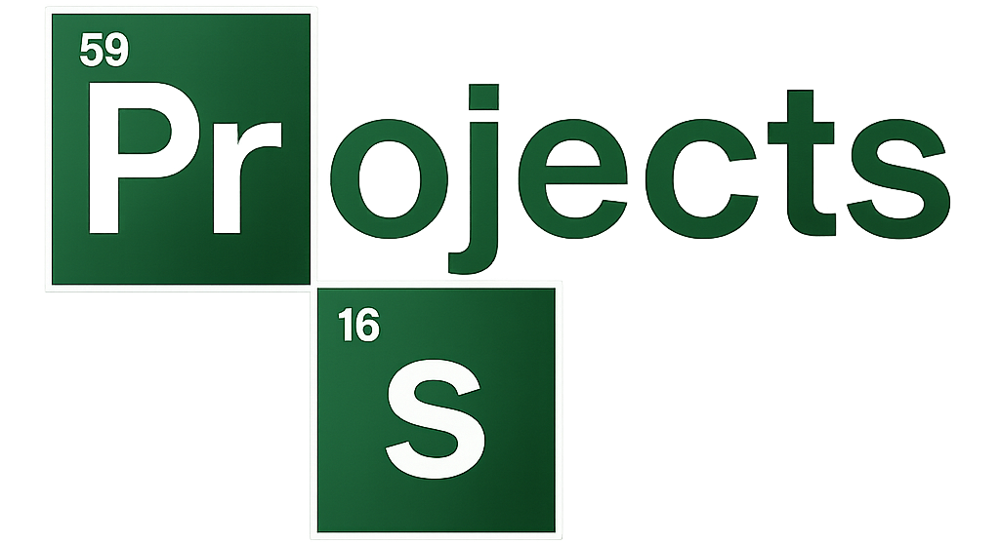

<!-- Cabeçalho com onda -->

<!-- Contador de visitas -->
 

  

<!-- Texto animado -->
 

  

 

   

<!-- Badge de repositórios públicos (manual) -->
 

<!-- Estatísticas do GitHub -->
 

  
  
    
  
    
  

  

  

  
  <!-- Título do Inventário -->
  <!-- Substitua pelo link da sua imagem do Textcraft se preferir a fonte do jogo -->
  
    

  <!-- LINHA 1: ARMAS (Front-end) -->
  
  
  
  
  
   

  <!-- LINHA 2: MAGIA (Web & Logic) -->
  
  
  
  
  <!-- Slot Vazio Estético -->
  
    

  <!-- Título Ferramentas -->
  
    

  <!-- LINHA 3: FERRAMENTAS -->
  
  
  
  
  
   
  
  <!-- LINHA 4: IDEs e Deploy -->
  
  
  
  
  

 

<!-- Banner -->

<!-- Rodapé com onda -->
 

